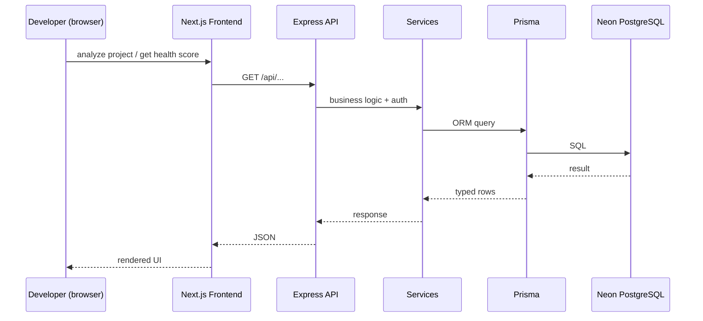

# DevPilot — Architecture

## System overview

```
┌────────────────────────────────────────────────────────────────┐
│                        DEVPILOT SAAS                           │
├────────────────────────────────────────────────────────────────┤
│                                                               │
│   ┌─────────────────────────────────────────────┐              │
│   │  FRONTEND  (apps/web)                       │              │
│   │  Next.js 15 · React · TypeScript · Tailwind │              │
│   │  Landing + Dashboard + AI Review            │              │
│   └──────────────────┬──────────────────────────┘              │
│                      │  HTTPS / REST JSON                      │
│   ┌──────────────────▼──────────────────────────┐              │
│   │  BACKEND API  (apps/api)                    │              │
│   │  Express · TypeScript · ESM                 │              │
│   │  routes → services → prisma client          │              │
│   └──────────────────┬──────────────────────────┘              │
│                      │  Prisma ORM                             │
│   ┌──────────────────▼──────────────────────────┐              │
│   │  DATABASE  (Neon PostgreSQL)                │              │
│   │  Branch: development / testing / production │              │
│   └─────────────────────────────────────────────┘              │
│                                                               │
└────────────────────────────────────────────────────────────────┘
```

**Hard rule:** the frontend never connects directly to the database. All data flows through the backend API.

## Infrastructure

```
 Developer
     │  git push
     ▼
   GitHub
     │  CI (lint · typecheck · build · test)
     ▼
   Vercel  ── Dev / Preview / Production environments
     │
     ├── Frontend (apps/web)   → static/SSR pages
     └── Backend  (apps/api)   → serverless REST API
     │
     ▼
   Prisma (migrate + client)
     │
     ▼
   Neon PostgreSQL (branch per environment)
```

## Request flow



## Monorepo layout

```
apps/
  web/   # Next.js 15 (App Router), src/ dir, Tailwind v4, ESLint
  api/   # Express 4 + TypeScript (ESM), Prisma 6, REST under /api
docs/    # architecture, api, database, testing, deployment,
         # ai-handoff, progress
```

Root: npm workspaces (`apps/*`, `packages/*`). Shared package deferred until needed.

## Layering rules (apps/api)

```
src/
  index.ts         → entry, env loading, listen
  app.ts           → express app, middleware, router mount
  routes/          → HTTP layer (validation, status codes)
  services/        → business logic (added in later phases)
  middleware/      → cross-cutting concerns (error, auth, ...)
  prisma client    → generated by `prisma generate`
```

- Routes never touch the DB directly; they call services.
- Services hold business logic and use the Prisma client.
- Errors are normalized by the global error middleware (`{ error: { message } }`).

## Environments

| Env | Vercel | Neon branch | Purpose |
|---|---|---|---|
| development | preview deployment | dev branch | local + feature work |
| testing | preview deployment | test branch | CI / E2E |
| production | production deployment | main branch | live SaaS |

Each environment has its own env vars (`DATABASE_URL`, API keys, secrets).

## Security posture

- Secrets only in `.env*` (gitignored) / Vercel env vars / GitHub Secrets. Never in code or docs.
- Frontend never receives DB credentials or private keys.
- API is the only DB-facing layer; CORS restricted to the web origin.
- Global error handler masks internal messages in production (>=500).

## Diagrams produced with

- Graphify: intended for knowledge-graph representation of the codebase (to be run once meaningful code exists).
- Napkin: visual workflows for onboarding/feature explanations (later phases).
